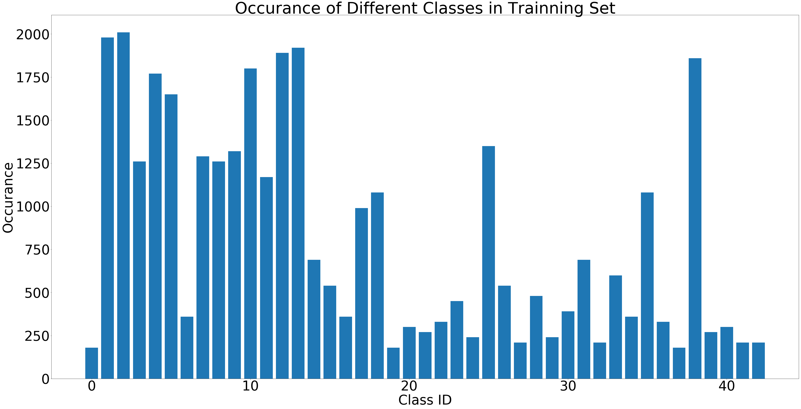
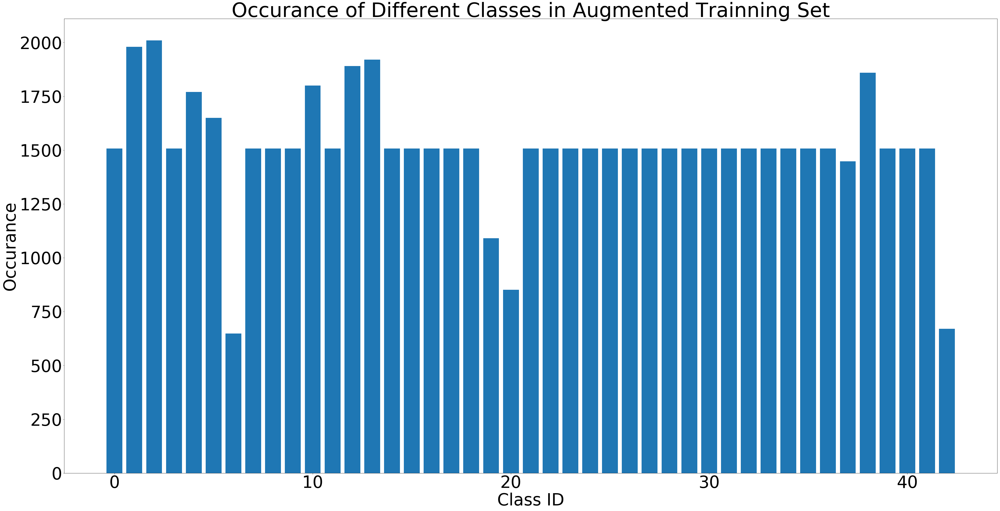
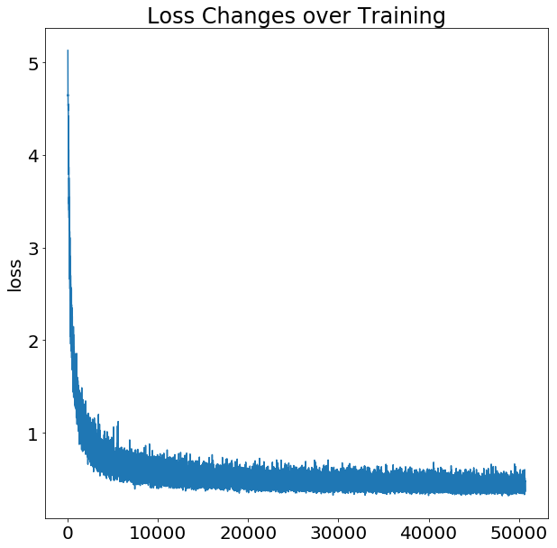
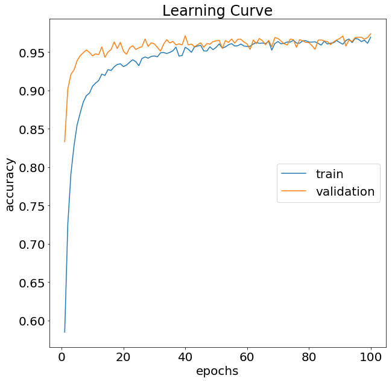

# **Traffic Sign Recognition** 

---

**Build a Traffic Sign Recognition Project**

The goals / steps of this project are the following:
* Load the data set 
* Explore, summarize and visualize the data set
* Design, train and test a model architecture
* Use the model to make predictions on new images
* Analyze the softmax probabilities of the new images
* Summarize the results with a written report

## Step 0: Load The Data
Data was acquired from GTSRB. 

## Step 1: Data set Exploration
The pickled data is a dictionary with 4 key/value pairs:
- `'features'` is a 4D array containing raw pixel data of the traffic sign images, (num examples, width, height, channels).
- `'labels'` is a 1D array containing the label/class id of the traffic sign. The file `signnames.csv` contains id -> name mappings for each id.
- `'sizes'` is a list containing tuples, (width, height) representing the original width and height the image.
- `'coords'` is a list containing tuples, (x1, y1, x2, y2) representing coordinates of a bounding box around the sign in the image. 

Our dataset includes: 
- 34799 training examples
- 4410 validating examples
- 12630 testing examples
- 43 different classes
 Here you can see one image from each classes in the training dataset:

And the occurance frequency of each class is shown in the following histogram: 

According the training set histogram, some classes have very few samples in the training set. So, I decided to produce some new training samples by augmenting the existing data. Three techniques are used for augmentation, including random rotation, random translation and random sheering of randaom samples chosen from existing training set. The brightness of each random selected sample is checked to prevent passing too dark images. Since the aim of this step is converting the training set to an evenly distributed set, only classes which have low number of samples will be augmented. As shown in the histogram below, different classes have reletively the same portions in the new training set. Here, you can see some samples produced by augmentation techniques.

## Step 2: Design the Model Architecture
In the preprocessing step, first I convert each image to the grayscale (according to this paper presented in the following link ((http://yann.lecun.com/exdb/publis/pdf/sermanet-ijcnn-11.pdf)), grayscale images will produce better results). Then, I normalized the gray image in the range (-1,1) to make the training less sensitive to the sacle of the features. 
The Initial articheture of my network was same as the LeNet presented in the lecture. However, its accuracy was not acceptable. Trying with several network architecture, I chosed two deep convolutional layers and three fully connected layer with following sizes. 
Also, I have used regularisation and dropout to prevent the overfitting. However, to prevent underfitting, the regulariztion factor shouold not be large.

| Layer         		|     Description	        					| 
|:---------------------:|:---------------------------------------------:| 
| Input         		| 32x32x1 RGB image   							| 
| Convolution 5x5     	| 1x1 stride, valid padding, outputs 28*28*12 	|
| RELU					|												|
| Max pooling	      	| 2x2 stride,  outputs 14x14x12 				|
| Convolution 5x5	    | 1x1 stride, valid padding, outputs 10*10*32 	|
| RELU					|												|
| Max pooling	      	| 2x2 stride,  outputs 5x5x32 					|
| Fully connected		| Input = 800, outputs = 240 					|
| RELU					| 			 									|
| Dropout				| 0.5											|
| Fully connected		| Input = 240, outputs = 129 					|
| RELU					| 			 									|
| Dropout				| 0.5											|
| Fully connected		| Input = 129, outputs = 43 					|
| Regulariztion 		| Beta = .001 									|
| Softmax 				| 			 									|
|						|												|
 
Besides model architecture parameters including number and size of the filters in each convolutional layer, pooling size, stride and number of nodes in each fully connected layer, I had other hyperparameters in this problem which are listed as follow: 
* Eochs = 100: I started with smaller number of epochs (20) but I found that the best result is acheived after 50 epochs. Although I could stop training in this stage, I continued for more 50 epochs to be sure that good training is achived.

* Batch_size = 128: I tried several batch sizes (100, 200, 1000, 2000 and 5000). I observed that with higher bach size the training gives better training accuracy and it converges to its best value sooner. However, the final answer with lower batch size is better despite of need for longer training. 

* Learning rate = 0.001: To avoid divergence and big oscillation in training, this value was chosen to be small. 

* Sigma = 0.1 and miu=0.0 for random initialization of wights in each layer (normal distribution): Since the feature values are reletively small (between -1 and 1), the initial weights should be also small to be comparable with the scale of features.

* Beta = 0.001 (regularization factor): I have used regularization to avoid overfitting. However, if this weight is too big the model woul be in danger of underfitting. 

* Dropout factor = 0.5: Dropout also has been used in two fully connected layers to prevent overfitting. I played with several numbers (0.4-0.8) and 0.5 gave me the best result since for high dropout the model might fail training the system efficiently. 

 
 ## Step 3: Training the Model
Following figures show the loss changes and the learning curves during the traing the model:

My final model results were:
* training set accuracy of 96.9%
* validation set accuracy of 97.4%
* test set accuracy of 94.6%

## Step 4: Test a Model on New Images
Seven new images were downloded from GTSRB:
![image7( ./examples/NewImg.png  )

Here are the results of the prediction:

| Image			        |     Prediction	        					| 
|:---------------------:|:---------------------------------------------:| 
| Beware of ice/snow	| Road Work    									| 
| Turn left ahead    	| Turn left ahead								|
| No passing			| No passing									|
| Pedestrians	   		| Pedestrians					 				|
| Speed limit (100km/h)	| Speed limit (20km/h) 							|
| Roundabout mandatory  | Roundabout mandatory			 				|
| Stop					| Stop 				 							|

The model was able to correctly guess 5 traffic signs out of 7 signs, which gives an accuracy of 71.4%. 
For the first image, the model is relatively sure that this is a "Road Work"  sign (probability of 0.92) or "Right-of-way at the next intersection" sign (probability of 0.04). This might be understandable since all these three signs have the triangle shape and the concentration of black colors in the middle of sign is haigh which makes the correct prediction difficult. The top five soft max probabilities for the "Beware of ice/snow" sign are:

| Probability         	|     Prediction	        					| 
|:---------------------:|:---------------------------------------------:| 
| .92         			| Road Work   									| 
| .04     				| Right-of-way at the next intersection			|
| .008					| Beware of ice/snow							|
| .006	      			| Priority road					 				|
| .005				    | Bumpy road	     							|

According to the output of our classifier, the correct class ID of the second wrong image has the least probability in top-5 high probable answers (0.002)! Our classifier has detected the circular shape of the sign and 4 of its guesses are speed limit signs. However, it has failed to detect the correct number which might be because of poor image quality of several speed limit signs.   

| Probability         	|     Prediction	        					| 
|:---------------------:|:---------------------------------------------:| 
| .39    	  			| Speed limit (20km/h)							| 
| .32 		 			| Roundabout mandatory							|
| .14			 		| Speed limit (50km/h)							|
| .08    			 	| Speed limit (30km/h)			 				|
| .002 			     	| Speed limit (100km/h)	     					|
